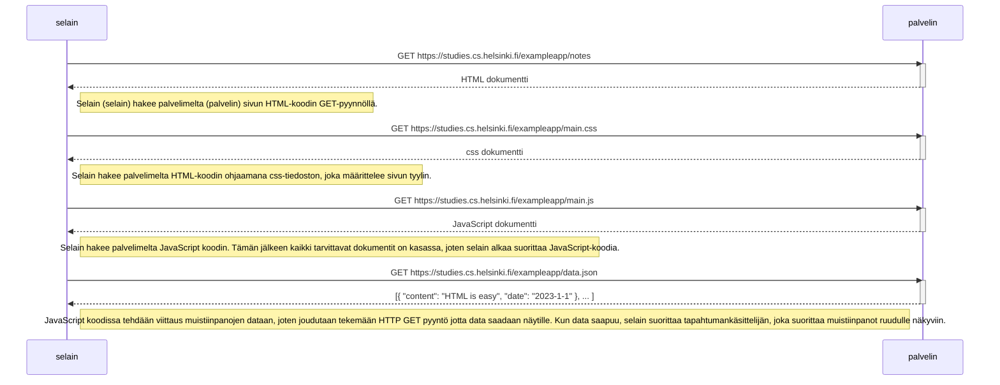

```mermaid

sequenceDiagram
    participant selain
    participant palvelin

    selain->>palvelin: GET https://studies.cs.helsinki.fi/exampleapp/notes
    activate palvelin
    palvelin-->>selain: HTML dokumentti
    deactivate palvelin

    Note right of selain: Selain (selain) hakee palvelimelta (palvelin) sivun HTML-koodin GET-pyynnöllä.
    
    selain->>palvelin: GET https://studies.cs.helsinki.fi/exampleapp/main.css
    activate palvelin
    palvelin-->>selain: css dokumentti
    deactivate palvelin

    Note right of selain: Selain hakee palvelimelta HTML-koodin ohjaamana css-tiedoston, joka määrittelee sivun tyylin.
    
    selain->>palvelin: GET https://studies.cs.helsinki.fi/exampleapp/main.js
    activate palvelin
    palvelin-->>selain: JavaScript dokumentti
    deactivate palvelin
    
    Note right of selain: Selain hakee palvelimelta JavaScript koodin. Tämän jälkeen kaikki tarvittavat dokumentit on kasassa, joten selain alkaa suorittaa JavaScript-koodia.
    
    selain->>palvelin: GET https://studies.cs.helsinki.fi/exampleapp/data.json
    activate palvelin
    palvelin-->>selain: [{ "content": "HTML is easy", "date": "2023-1-1" }, ... ]
    deactivate palvelin    

    Note right of selain: JavaScript koodissa tehdään viittaus muistiinpanojen dataan, joten joudutaan tekemään HTTP GET pyyntö jotta data saadaan näytille. Kun data saapuu, selain suorittaa tapahtumankäsittelijän, joka suorittaa muistiinpanot ruudulle näkyviin.

```