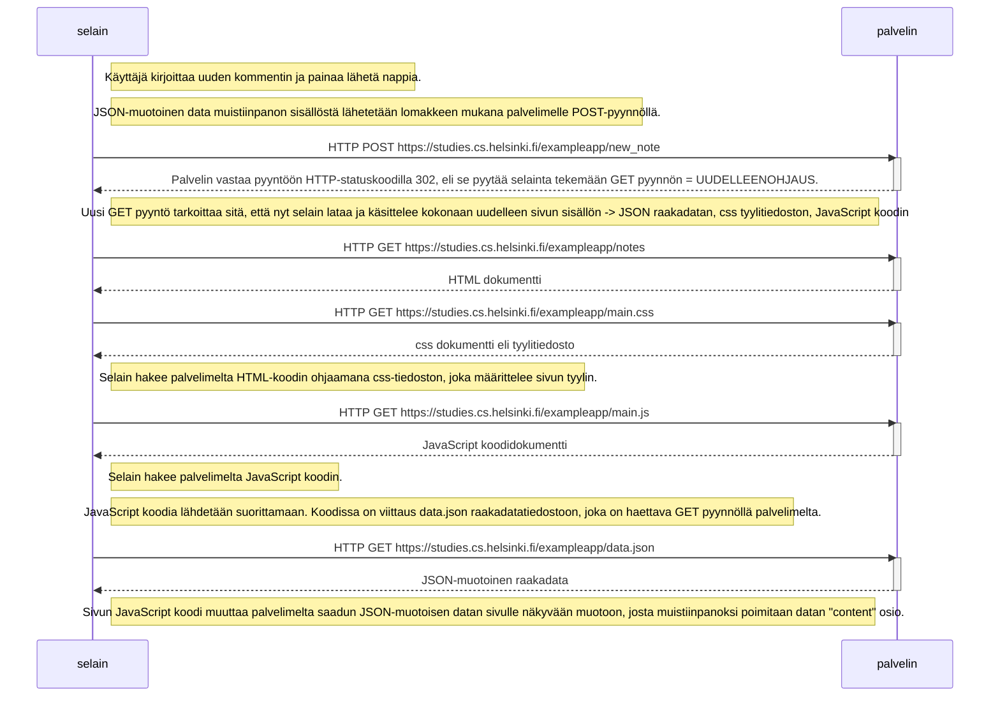

```mermaid

sequenceDiagram
    participant selain
    participant palvelin

    Note right of selain: Käyttäjä kirjoittaa uuden kommentin ja painaa lähetä nappia.
    Note right of selain: JSON-muotoinen data muistiinpanon sisällöstä lähetetään lomakkeen mukana palvelimelle POST-pyynnöllä.

    selain->>palvelin: HTTP POST https://studies.cs.helsinki.fi/exampleapp/new_note
    activate palvelin
    palvelin-->>selain: Palvelin vastaa pyyntöön HTTP-statuskoodilla 302, eli se pyytää selainta tekemään GET pyynnön = UUDELLEENOHJAUS.
    deactivate palvelin

    Note right of selain: Uusi GET pyyntö tarkoittaa sitä, että nyt selain lataa ja käsittelee kokonaan uudelleen sivun sisällön -> JSON raakadatan, css tyylitiedoston, JavaScript koodin

    selain->>palvelin: HTTP GET https://studies.cs.helsinki.fi/exampleapp/notes
    activate palvelin
    palvelin-->>selain: HTML dokumentti
    deactivate palvelin
    
    selain->>palvelin: HTTP GET https://studies.cs.helsinki.fi/exampleapp/main.css
    activate palvelin
    palvelin-->>selain: css dokumentti eli tyylitiedosto
    deactivate palvelin

    Note right of selain: Selain hakee palvelimelta HTML-koodin ohjaamana css-tiedoston, joka määrittelee sivun tyylin.
    
    selain->>palvelin: HTTP GET https://studies.cs.helsinki.fi/exampleapp/main.js
    activate palvelin
    palvelin-->>selain: JavaScript koodidokumentti
    deactivate palvelin
    
    Note right of selain: Selain hakee palvelimelta JavaScript koodin.
    Note right of selain: JavaScript koodia lähdetään suorittamaan. Koodissa on viittaus data.json raakadatatiedostoon, joka on haettava GET pyynnöllä palvelimelta.
    
    selain->>palvelin: HTTP GET https://studies.cs.helsinki.fi/exampleapp/data.json
    activate palvelin
    palvelin-->>selain: JSON-muotoinen raakadata
    deactivate palvelin    

    Note right of selain: Sivun JavaScript koodi muuttaa palvelimelta saadun JSON-muotoisen datan sivulle näkyvään muotoon, josta muistiinpanoksi poimitaan datan "content" osio.

```