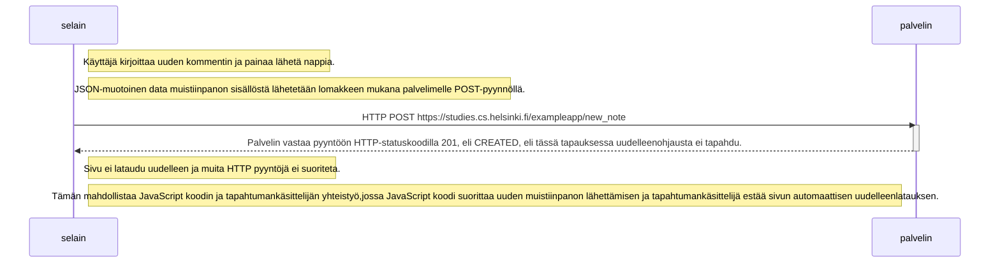

```mermaid

sequenceDiagram
    participant selain
    participant palvelin

    Note right of selain: Käyttäjä kirjoittaa uuden kommentin ja painaa lähetä nappia.
    Note right of selain: JSON-muotoinen data muistiinpanon sisällöstä lähetetään lomakkeen mukana palvelimelle POST-pyynnöllä.

    selain->>palvelin: HTTP POST https://studies.cs.helsinki.fi/exampleapp/new_note
    activate palvelin
    palvelin-->>selain: Palvelin vastaa pyyntöön HTTP-statuskoodilla 201, eli CREATED, eli tässä tapauksessa uudelleenohjausta ei tapahdu.
    deactivate palvelin

    Note right of selain: Sivu ei lataudu uudelleen ja muita HTTP pyyntöjä ei suoriteta.
    Note right of selain: Tämän mahdollistaa JavaScript koodin ja tapahtumankäsittelijän yhteistyö,jossa JavaScript koodi suorittaa uuden muistiinpanon lähettämisen ja tapahtumankäsittelijä estää sivun automaattisen uudelleenlatauksen.

```